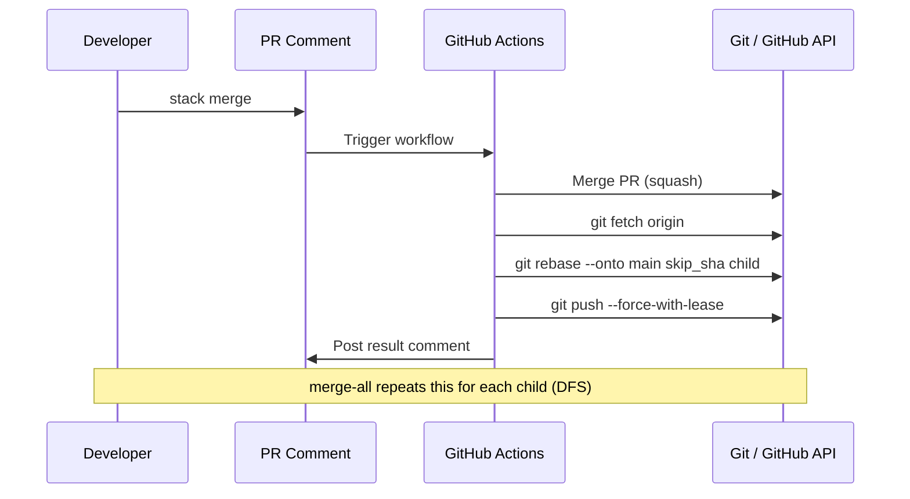

[](https://github.com/siner308/staqd)
[](https://opensource.org/licenses/MIT)
[](https://github.com/siner308/staqd/releases)

# Staqd

**/stakt/** — like "stacked"

Stacked PR merge queue powered by GitHub Actions and PR comments.
No CLI to install. No SaaS dependency. One workflow file is all you need.

## Usage

### Basic

```yaml
name: Staqd

on:
  pull_request:
    types: [opened, edited]
  issue_comment:
    types: [created]

jobs:
  # Guide comment — no concurrency needed
  guide:
    if: github.event_name == 'pull_request'
    runs-on: ubuntu-latest
    permissions:
      pull-requests: write
      issues: write
    steps:
      - uses: siner308/staqd@v1

  # Resolve base branch for concurrency group
  resolve-base:
    if: >-
      github.event_name == 'issue_comment'
      && github.event.issue.pull_request
      && (startsWith(github.event.comment.body, 'stack ') || startsWith(github.event.comment.body, 'st '))
    runs-on: ubuntu-latest
    permissions:
      pull-requests: read
    outputs:
      base-ref: ${{ steps.get.outputs.base-ref }}
    steps:
      - id: get
        uses: actions/github-script@v7
        with:
          script: |
            const { data: pr } = await github.rest.pulls.get({
              ...context.repo,
              pull_number: context.payload.issue.number,
            });
            core.setOutput('base-ref', pr.base.ref);

  # Execute command — serialized per base branch
  command:
    needs: resolve-base
    concurrency:
      group: staqd-${{ needs.resolve-base.outputs.base-ref }}
      cancel-in-progress: false
    runs-on: ubuntu-latest
    timeout-minutes: 30
    permissions:
      contents: write
      pull-requests: write
      issues: write
      checks: read
    steps:
      - uses: siner308/staqd@v1
```

### With GitHub App (recommended for CI auto-trigger)

```yaml
      - uses: siner308/staqd@v1
        with:
          app-id: ${{ vars.STACK_APP_ID }}
          app-private-key: ${{ secrets.STACK_APP_PRIVATE_KEY }}
```

### With PAT

```yaml
      - uses: siner308/staqd@v1
        with:
          token: ${{ secrets.STACK_BOT_TOKEN }}
```

### With custom runners

Staqd is a composite action — `runs-on` is controlled by your workflow, not the action. Use any runner you need:

```yaml
jobs:
  guide:
    runs-on: self-hosted
    steps:
      - uses: siner308/staqd@v1

  resolve-base:
    runs-on: [self-hosted, linux, arm64]
    # ...

  command:
    runs-on: ubuntu-latest-4-cores
    # ...
```

### Inputs

| Input | Description | Required | Default |
|-------|-------------|----------|---------|
| `token` | GitHub token for API calls and git operations. Use a PAT or GitHub App token to enable CI auto-trigger after force push. | No | `github.token` |
| `app-id` | GitHub App ID. Used with `app-private-key` to generate an installation token. | No | |
| `app-private-key` | GitHub App private key. Used with `app-id` to generate an installation token. | No | |

> **Why a custom token?** `GITHUB_TOKEN` pushes don't trigger other workflows (GitHub security policy). If your CI needs to run after a restack force-push, use a GitHub App or PAT.

## Commands

Comment on a PR to trigger:

| Command | Action |
|---------|--------|
| `stack merge` (`st merge`) | Merge this PR and restack child branches |
| `stack merge-all` (`st merge-all`) | Merge the entire stack in order (all PRs must be approved) |
| `stack merge-all --force` (`st merge-all --force`) | Merge the entire stack (skip approval check) |
| `stack restack` (`st restack`) | Rebase child branches without merging |
| `stack help` (`st help`) | Show usage |

> **Tip:** All commands support the short alias `st` — e.g., `st merge` instead of `stack merge`.

## Setting Up a Stack

### 1. Create stacked branches

```bash
git checkout main
git checkout -b feat-auth
# ... make changes, push ...

git checkout feat-auth
git checkout -b feat-auth-ui
# ... make changes, push ...

git checkout feat-auth-ui
git checkout -b feat-auth-tests
# ... make changes, push ...
```

### 2. Create PRs with correct base branches

```bash
gh pr create --base main       --head feat-auth       --title "feat: add auth module"   # → PR #1
gh pr create --base feat-auth  --head feat-auth-ui    --title "feat: add auth UI"       # → PR #2
gh pr create --base feat-auth-ui --head feat-auth-tests --title "test: add auth tests"  # → PR #3
```

### 3. Add stack metadata to parent PR bodies

Each parent PR's body needs an HTML comment listing its direct children:

```bash
# PR #1 body — child is PR #2
gh api repos/{owner}/{repo}/pulls/1 --method PATCH --input - <<'EOF'
{"body": "Add auth module\n\n<!-- stack-rebase:{\"children\":[{\"branch\":\"feat-auth-ui\",\"pr\":2}]} -->"}
EOF

# PR #2 body — child is PR #3
gh api repos/{owner}/{repo}/pulls/2 --method PATCH --input - <<'EOF'
{"body": "Add auth UI\n\n<!-- stack-rebase:{\"children\":[{\"branch\":\"feat-auth-tests\",\"pr\":3}]} -->"}
EOF

# PR #3 — no children, no metadata needed
```

> **Note:** Use `gh api` instead of `gh pr edit --body` because some shells strip HTML comments.

### 4. Use commands

```
# During development — sync children after pushing to parent
Comment on PR #1: "stack restack"

# After review — merge the entire stack at once
Comment on PR #1: "stack merge-all"
```

## Metadata Format

```html
<!-- stack-rebase:{"children":[{"branch":"<branch>","pr":<number>}]} -->
```

Only list **direct children**. `merge-all` recursively follows each child's metadata.

**Linear stack** (A → B → C):
```
PR #1 body: <!-- stack-rebase:{"children":[{"branch":"B","pr":2}]} -->
PR #2 body: <!-- stack-rebase:{"children":[{"branch":"C","pr":3}]} -->
PR #3 body: (none)
```

**Tree stack** (X and Y branch from base):
```
PR #10 body: <!-- stack-rebase:{"children":[{"branch":"X","pr":11},{"branch":"Y","pr":12}]} -->
PR #11 body: (none)
PR #12 body: (none)
```

Tree children are siblings — each rebases independently onto the same parent.

## How It Works

Everything reduces to one git command:

```
git rebase --onto <new_base> <old_parent_tip_sha> <child_branch>
```

```
Before (feat-1 squash-merged into main):

main:     A───B───CD'          (C+D squashed into new commit)
feat-2:       C───D───E───F    (still contains original C, D)

After:
git rebase --onto main <SHA_of_D> feat-2

main:     A───B───CD'
                    \
feat-2:              E'───F'   (C, D removed; only E, F rebased)
```

The skip SHA (`old_parent_tip_sha`) comes from GitHub's PR API, which preserves `head.sha` even after merge. No database needed.

### Workflow



## Handling Conflicts

When a conflict occurs, the bot posts manual fix commands:

```
Restack: Action Needed

| Branch | PR | Status |
|--------|-----|--------|
| feat-auth-ui | #2 | Restacked |
| feat-auth-tests | #3 | Conflict |

Manual restack commands:
  git fetch origin
  git rebase --onto origin/feat-auth-ui <skip_sha> feat-auth-tests
  # resolve conflicts
  git push origin feat-auth-tests --force-with-lease
```

## Design Decisions

<details>
<summary>Why HTML comments in PR body?</summary>

- No metadata files polluting the codebase
- Readable/writable via GitHub API — no separate storage
- Invisible when rendered — no noise for reviewers
- PR body is deterministic (one per PR); comments checked as fallback
</details>

<details>
<summary>Why only direct children (not all descendants)?</summary>

- Enables tree-shaped stacks where one parent has multiple children
- All children are siblings — each rebases independently (no chaining)
- `merge-all` recursively traverses each child's metadata (DFS)
</details>

<details>
<summary>Why different --onto targets for restack vs merge?</summary>

| Scenario | `--onto` target | Reason |
|----------|----------------|--------|
| `stack restack` (pre-merge) | `origin/<parent_branch>` | Must include parent's new commits |
| `stack merge` (post-merge) | `origin/main` | Parent already merged into main |
| `stack merge-all` | `origin/main` | Each PR merges into main sequentially |
</details>

<details>
<summary>Why --force-with-lease?</summary>

Rejects the push if the remote ref changed since last fetch. Prevents overwriting commits pushed by others.
</details>

<details>
<summary>Why retry merge API instead of polling checks API?</summary>

- Check suite names vary by repo — would require configuration
- Merge API already reports "CI still pending" as an error
- Retries every 30s, up to 20 times (~10 min)
</details>

<details>
<summary>Why per-base-branch concurrency?</summary>

```yaml
concurrency:
  group: staqd-${{ needs.resolve-base.outputs.base-ref }}
  cancel-in-progress: false
```

Commands targeting the same base branch (e.g. `main`) are serialized to prevent race conditions and force-push conflicts. Independent stacks targeting different base branches run in parallel. `cancel-in-progress: false` creates a FIFO queue per base branch.
</details>

## Alternatives

| | Staqd | Graphite | ghstack |
|---|---|---|---|
| Installation | None (workflow file) | CLI + account | CLI |
| Stack storage | PR body HTML comments | `.graphite_info` + server | Commit metadata |
| Restack trigger | PR comment | `gt restack` CLI | `ghstack` CLI |
| Conflict resolution | Async (Actions → local fix → push) | Sync (terminal) | Sync (terminal) |
| Tree stacks | Supported (siblings) | Supported (DAG) | Linear only |
| Merge queue | Comment-based | Dedicated UI | None |
| External dependency | None | SaaS | None |

## Troubleshooting

**CI doesn't run after restack push:**
`GITHUB_TOKEN` pushes don't trigger other workflows. Set up a GitHub App or PAT.

**merge-all CI timeout:**
Default wait is ~10 min (30s × 20 retries). Increase `tryMerge` retry count for slower CI.

**PR diff looks wrong after restack:**
The PR's base branch may not have been updated. `stack restack` handles this automatically, but you can manually change the base in PR settings.

**Second PR in merge-all always fails initially:**
If branch protection has required checks, CI may not exist yet right after restack. `tryMerge` retries until CI is created and passes.

## License

MIT
